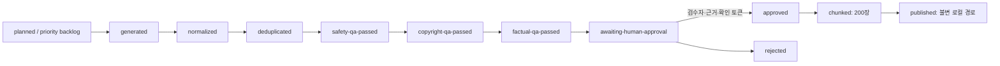

# 다외워 콘텐츠 파이프라인

공급자 운영자가 덱을 배치 생성·증강하고, 출처·라이선스·안전·저작권·사실·사람 검수를 거쳐 200장 불변 청크로 로컬 발행하는 독립 Node 패키지다. 앱이나 사용자 요청에서 호출하는 HTTP API는 제공하지 않는다. **사용자 즉석 AI 덱 생성은 금지**다.

## 현재 산출물

- `manifests/v1.json`: 승인 기획서의 v2 23덱. Free 8 / Pro 15, P1 8 / P2 12 / P3 3.
- `schemas/card.schema.json`: 어휘·자격증·역사·직무를 공통으로 담는 generic Card JSON Schema.
- `schemas/catalog.schema.json`: `source`, `license`, `provenance`, `reviewer`, `status`, `version`, `chunkSize=200`을 강제하는 카탈로그 Schema.
- `backlog/priority-backlog.json`: 덱 요청·검색 미스·트렌드·운영 기획 집계 신호와 Pro 요청 가산 우선순위.
- `fixtures/offline/`: P1 `한국사능력검정 핵심`, `IT/CS 면접 용어`의 네트워크 없는 생성·증강 fixture.
- `src/providers/vocab-swipe-import.mjs`: commit이 고정된 vocab-swipe checkout에서 TOEIC 어휘 덱을 가져오는 importer.
- `docs/vocab-swipe-import-boundary.md`: CC BY-SA / MIT / WordNet 자산의 import 및 배포 경계.

fixture는 QA 후 `awaiting-human-approval`에서 멈춘다. 저장된 manifest와 fixture 어느 것도 `published`로 표시하지 않는다.
`fixtureOnly: true` record는 사람이 승인해도 `publish`가 거부하므로 실제 source로 다시 생성해야 한다.

## 상태기계



자동 smoke, Gemini 생성, 정규화, QA는 `awaiting-human-approval`을 넘을 수 없다. `approve`는 검수자 이름, 검수 근거, 정확한 확인 토큰을 모두 요구한다. `publish`는 승인 정보가 없는 work record를 거부하고, 이미 존재하는 `decks/<deckId>/v<version>`을 덮어쓰지 않는다.

## 실행

루트 workspace의 `content-pipeline` 패키지로 등록되어 있다. 아래 명령은 repo
루트에서 `--dir`로 독립 실행할 때와 동일하게 동작한다.

```bash
pnpm --dir content-pipeline run validate
pnpm --dir content-pipeline run test
pnpm --dir content-pipeline run smoke
pnpm --dir content-pipeline run check
pnpm --dir content-pipeline run backlog
```

offline fixture를 work record로 남기려면:

```bash
pnpm --dir content-pipeline exec node src/cli.mjs run \
  --deck it-cs-interview-terms \
  --provider offline \
  --output .work/it-cs-interview-terms.json
```

## vocab-swipe TOEIC import

`english-essential-intro`와 `english-toeic-advanced`는 AI 생성이 아니라 commit이 고정된
vocab-swipe checkout에서 가져온다. importer는 checkout의 `git rev-parse HEAD`가 manifest
`source.commit`과 다르거나 생성 헤더 revision이 `source.revision`과 다르면 즉시 실패한다.
upstream을 새로 fetch하지 않고 이미 검증된 snapshot bytes만 읽는다.

```bash
git clone https://github.com/seorilabs/vocab-swipe /path/to/vocab-swipe
git -C /path/to/vocab-swipe checkout e1ba2d5503d1f90ee9d6995c80070b0e2e3152e6

pnpm --dir content-pipeline exec node src/cli.mjs run \
  --deck english-essential-intro \
  --provider vocab-swipe \
  --source-root /path/to/vocab-swipe \
  --output .work/english-essential-intro.json
```

TSL 1.2 1,250행은 두 덱이 겹치지 않게 나눠 가진다.

| 덱 | tier | rank 구간 | 카드 | 본문 구성 |
| --- | --- | --- | --- | --- |
| `english-essential-intro` | free | 1~300 | 300 | TSL 정의(`hint`) + 한국어 뜻 + 예문·번역 |
| `english-toeic-advanced` | pro | 301~1250 | 950 | 한국어 뜻 + 자체 작성 예문·번역 |

JLPT 덱은 같은 provider(`--provider vocab-swipe`)로 실행하며, MIT 표제어·읽기와 자체
생성 한국어 보강(뜻·예문·번역·학습 팁)의 **교집합**만 카드가 된다. 보강이 의도적으로
비워진 행(카운터·접사·중복 이표기)은 조용히 건너뛰고, 보강이 있는데 필드가 비면
실패한다. 같은 표제어가 여러 레벨에 있으면 첫 등장 레벨이 이긴다(N3~N2 덱은 N3 우선).

| 덱 | tier | 레벨 | 카드 | 난이도 |
| --- | --- | --- | --- | --- |
| `japanese-jlpt-n5-preview` | free | N5 | 525 | 1 |
| `japanese-jlpt-n4` | pro | N4 | 494 | 2 |
| `japanese-jlpt-n3-n2` | pro | N3, N2 | 2,688 | N3=3, N2=4 |
| `japanese-jlpt-n1` | pro | N1 | 2,234 | 5 |

`sourceRefs`는 카드가 실제로 쓴 라이선스 성분만 가리킨다. 표제어는 CC BY-SA TSL, 한국어
뜻과 예문 번역은 자체 작성이고, WordNet 예문을 자체 예문이 덮어쓰면 그 카드의 WordNet
성분 표시는 사라진다. `difficulty`는 빈도 rank를 250행 단위로 나눈 1~5 값이다.

출력 상태는 `awaiting-human-approval`이다. 실제 사람이 카드, 출처, 라이선스, 사실을 확인하고 근거를 남긴 뒤에만:

```bash
pnpm --dir content-pipeline exec node src/cli.mjs approve \
  --work .work/it-cs-interview-terms.json \
  --reviewer "홍길동" \
  --evidence "review-ticket://DAOEWO-CONTENT-001" \
  --confirm-human-review I_REVIEWED_THE_DECK_CONTENT

pnpm --dir content-pipeline exec node src/cli.mjs publish \
  --work .work/it-cs-interview-terms.json \
  --output published
```

`publish`는 Cloud Storage 업로드가 아니라 배포 후보 불변 JSON을 만든다. 실제 버킷 업로드와 카탈로그 공개는 배포 자격증명·승인 범위에서 별도로 수행해야 한다.

## 운영자 batch 파일

`ai-assisted-operator-batch` 덱은 Gemini adapter 외에, 운영자가 오프라인에서 작성해
`batches/<deckId>.raw.json`으로 커밋한 batch 파일로도 실행할 수 있다. batch 파일은
카드 배열과 revision이 고정된 `sourceRegistry`를 담아야 하며, provider 이름
(`claude-operator-batch-v1`)이 provenance `generatedBy`로 기록되어 생성 주체가 남는다.

```bash
pnpm --dir content-pipeline exec node src/cli.mjs run \
  --deck wine-basics \
  --provider batch \
  --input batches/wine-basics.raw.json \
  --output .work/wine-basics.json
```

batch 파일은 검수 대기 초안이지 앱 콘텐츠가 아니다. 다른 경로와 동일하게
normalize/dedupe/QA를 거쳐 `awaiting-human-approval`에서 멈추고, 사람 승인 없이는
`publish`가 거부한다. `fixtureOnly: true`가 붙은 파일은 이 provider가 거부한다.

## Gemini 운영 adapter

텍스트 생성은 `src/providers/gemini.mjs`의 **server/operator CLI adapter**에서만 실행한다. 키는 환경변수에서만 읽고 URL, 오류 본문, 로그에 출력하지 않는다.

```bash
export GEMINI_API_KEY='...'
export GEMINI_TEXT_MODEL='gemini-2.5-flash' # 선택, 기본값과 동일

pnpm --dir content-pipeline exec node src/cli.mjs run \
  --deck it-cs-interview-terms \
  --provider gemini \
  --output .work/it-cs-interview-terms.json
```

- `vocab-swipe-import` 덱을 Gemini 신규 생성으로 대체할 수 없다. pinned source import가 필요하다.
- Gemini 결과도 자동 발행되지 않고 동일한 dedupe/QA/사람 승인 게이트를 통과해야 한다.
- `.env` 로더를 두지 않아 client bundle이나 generated JSON에 키가 섞이는 경로를 만들지 않았다.

## 이미지

이미지가 실제로 필요해질 때만 `src/providers/imagen.mjs`를 사용한다. 이미지 provider는 Imagen으로 분리되어 있고 `IMAGEN_MODEL`이 `imagen-`으로 시작하지 않으면 거부한다. 기본값은 `imagen-4.0-generate-001`이다. 현재 fixture와 smoke는 이미지를 생성하지 않는다.

```bash
export GEMINI_API_KEY='...'
export IMAGEN_MODEL='imagen-4.0-generate-001' # 선택

pnpm --dir content-pipeline exec node src/cli.mjs image \
  --prompt-file .work/card-image-prompt.txt \
  --output .work/card-image.png \
  --aspect-ratio 1:1
```

국기처럼 정확한 표준 도안이 필요한 이미지는 Imagen 생성 대상이 아니다. 공식 자산의 사용 조건을 별도 확인한다.

## QA의 의미

- safety: 합격·수익·치료 보장, 공식 제휴 오인, 위험 지침, 미성년 음주 표현을 차단한다.
- copyright: 운영자가 넣은 `referenceTexts`와 80자 이상 연속 중복되는 원문 복제 의심 카드를 차단한다.
- factual: 모든 `sourceRefs`가 revision 고정된 `sourceRegistry`에 존재하고 placeholder가 없는지 확인한다.
- human: 자동 factual QA는 **진실을 증명하지 않는다**. 사람 검수자가 실제 출처와 카드 내용을 대조해야 한다.

검증기와 테스트는 카드 스키마, 중복, 금칙표현, 원문복제 휴리스틱, 라이선스, 외부 source pin, 23덱 tier/priority 합계, 승인 없는 publish 거부, 200장 청크를 다룬다.
