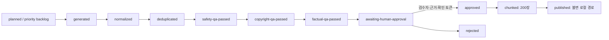

# 다외워 콘텐츠 파이프라인

공급자 운영자가 덱을 배치 생성·증강하고, 출처·라이선스·안전·저작권·사실·사람 검수를 거쳐 200장 불변 청크로 로컬 발행하는 독립 Node 패키지다. 앱이나 사용자 요청에서 호출하는 HTTP API는 제공하지 않는다. **사용자 즉석 AI 덱 생성은 금지**다.

## 현재 산출물

- `manifests/v1.json`: 승인 기획서의 14덱. Free 6 / Pro 8, P1 7 / P2 5 / P3 2.
- `schemas/card.schema.json`: 어휘·자격증·역사·직무를 공통으로 담는 generic Card JSON Schema.
- `schemas/catalog.schema.json`: `source`, `license`, `provenance`, `reviewer`, `status`, `version`, `chunkSize=200`을 강제하는 카탈로그 Schema.
- `backlog/priority-backlog.json`: 덱 요청·검색 미스·트렌드·운영 기획 집계 신호와 Pro 요청 가산 우선순위.
- `plans/p1-ai-batch.json`: 한국사 500장, 정보처리기사 320장, IT/CS 인터뷰 420장을 20장 coverage slot과 덱별 고정 공식·권위 source allowlist로 정의한 P1 계획.
- `fixtures/offline/`: P1 `한국사능력검정 핵심`, `IT/CS 면접 용어`의 네트워크 없는 생성·증강 fixture.
- `docs/vocab-swipe-import-boundary.md`: CC BY-SA / MIT / WordNet 자산의 import 및 배포 경계.

fixture는 QA 후 `awaiting-human-approval`에서 멈춘다. 저장된 manifest와 fixture 어느 것도 `published`로 표시하지 않는다.
`fixtureOnly: true` record는 사람이 승인해도 `publish`가 거부하므로 실제 source로 다시 생성해야 한다.

## 상태기계



자동 smoke, Gemini 생성, 정규화, QA는 `awaiting-human-approval`을 넘을 수 없다. `approve`는 검수자 이름, 검수 근거, 정확한 확인 토큰을 모두 요구한다. `publish`는 승인 정보가 없는 work record를 거부하고, 이미 존재하는 `decks/<deckId>/v<version>`을 덮어쓰지 않는다.

## 실행

루트 workspace의 `content-pipeline` 패키지로 등록되어 있다. 아래 명령은 repo
루트에서 `--dir`로 독립 실행할 때와 동일하게 동작한다.

```bash
pnpm --dir content-pipeline run validate
pnpm --dir content-pipeline run test
pnpm --dir content-pipeline run smoke
pnpm --dir content-pipeline run check
pnpm --dir content-pipeline run backlog
```

offline fixture를 work record로 남기려면:

```bash
pnpm --dir content-pipeline exec node src/cli.mjs run \
  --deck it-cs-interview-terms \
  --provider offline \
  --output .work/it-cs-interview-terms.json
```

고정된 `vocab-swipe` snapshot에서 P1 어휘 4덱을 가져오려면 source checkout을 명시한다. 현재 branch나 working tree가 아니라 commit `e1ba2d5503d1f90ee9d6995c80070b0e2e3152e6`의 blob을 `git show`로 읽고 입력 파일 SHA-256을 검증한다.

```bash
pnpm --dir content-pipeline run import:vocab-swipe -- \
  --source-repo /absolute/path/to/vocab-swipe
```

`english-essential-intro` 600장, `english-toeic-advanced` 1,250장, `japanese-jlpt-n5-preview` 240장, `japanese-jlpt-n3-n2` 2,688장을 `content-pipeline/.work/<deck-id>.json`에 만든다. 결과는 자동 QA를 거친 `awaiting-human-approval` draft이며 승인·청크·발행으로 자동 전이하지 않는다. 상세 선별·해시·라이선스 경계는 `docs/vocab-swipe-import-boundary.md`에 있다.

출력 상태는 `awaiting-human-approval`이다. 실제 사람이 카드, 출처, 라이선스, 사실을 확인하고 근거를 남긴 뒤에만:

```bash
pnpm --dir content-pipeline exec node src/cli.mjs approve \
  --work .work/it-cs-interview-terms.json \
  --reviewer "홍길동" \
  --evidence "review-ticket://DAOEWO-CONTENT-001" \
  --confirm-human-review I_REVIEWED_THE_DECK_CONTENT

pnpm --dir content-pipeline exec node src/cli.mjs publish \
  --work .work/it-cs-interview-terms.json \
  --output published
```

`publish`는 Cloud Storage 업로드가 아니라 배포 후보 불변 JSON을 만든다. 실제 버킷 업로드와 카탈로그 공개는 배포 자격증명·승인 범위에서 별도로 수행해야 한다.

## Gemini 운영 batch

텍스트 생성은 `src/providers/gemini.mjs`의 **server/operator CLI adapter**에서만 실행한다. `plans/p1-ai-batch.json`의 coverage와 source ID만 요청에 사용하며, 모델이 `sourceRegistry`를 만들거나 allowlist 밖 source ID를 반환하면 응답을 거부한다. 여기서 batch는 Gemini Batch API가 아니라 standard `generateContent` 호출을 20장 단위로 재개 가능하게 관리하는 운영 방식이다.

기본 모델은 `gemini-2.5-flash`다. 자격증명은 아래 순서로 메모리에만 읽고 값은 URL, 상태 파일, 오류 본문, 로그에 출력하지 않는다.

1. 현재 프로세스의 `GEMINI_API_KEY`
2. 현재 프로세스의 `GEMINI_API_KEY_WITH_PAYMENT`
3. `~/.config/seorilabs/gemini-api-key.env`의 `GEMINI_API_KEY_WITH_PAYMENT`

2·3번 값은 호출 시 `GEMINI_API_KEY`로 매핑된다. 키 파일을 `source`하거나 shell로 실행하지 않는다. 모델을 바꿀 때만 `GEMINI_TEXT_MODEL`을 주입한다.

```bash
# 실제 유료 API 호출. 먼저 plan과 비용 범위를 확인한다.
pnpm --dir content-pipeline run batch:run -- \
  --deck it-cs-interview-terms

# 네트워크 호출 없이 저장된 진행 상태와 usage 합계 확인
pnpm --dir content-pipeline run batch:status -- \
  --deck it-cs-interview-terms
```

기본 경로는 다음과 같다.

- `.work/batch-runs/<deck-id>/run.json`: 호출 수, slot 충족 수, 거부·중복·충돌 수, token usage 합계.
- `.work/batch-runs/<deck-id>/batches/<slot-id>/attempt-*.json`: 요청 전 `requesting`, 완료·실패 상태, 응답 digest, usage, raw 응답.
- `.work/batch-runs/<deck-id>/record.json`: 완성된 run 내부 record.
- `.work/<deck-id>.json`: preview와 후속 사람 검수용 최종 record. 정확한 목표 장수를 채운 뒤 원자적으로 생성한다.
- `.work/legacy/<deck-id>/<sha256>.json`: 기존 root record가 있으면 덮어쓰기 전에 원문 그대로 보존한다.

재실행하면 같은 plan digest의 완료 attempt를 검증해 재사용하고, 중복·구조·source·safety·placeholder 검사에서 제외된 카드 수만 보충한다. exact target과 모든 coverage slot을 채운 결과만 `awaiting-human-approval`에 도달하며 승인·발행은 자동 수행하지 않는다. 같은 front에 서로 다른 back이 나오면 어느 답도 자동 선택하지 않고 해당 front의 후보를 모두 `front-conflict`로 격리한 뒤 slot 부족분을 보충 생성한다.

프로세스가 응답 저장 전 끊겨 `requesting` attempt가 남으면 먼저 API 사용 내역을 확인한다. 중복 과금 가능성을 수용하고 다시 호출할 때만 `--retry-uncertain`을 명시한다.

```bash
pnpm --dir content-pipeline run batch:run -- \
  --deck it-cs-interview-terms \
  --retry-uncertain \
  --max-calls 36
```

`.operator.lock`이 남았다고 바로 삭제하지 않는다. 실행 중인 operator가 없음을 확인한 stale lock에만 `--force-unlock`을 사용한다. 별도 실험은 기존 run과 섞이지 않도록 `--run-root <directory>`를 지정하고, preview 호환 최종 경로를 바꿀 때만 `--output <file>`을 사용한다.

`vocab-swipe-import` 덱은 Gemini 신규 생성으로 대체할 수 없으며 pinned source import가 필요하다. 자동 factual QA는 allowlist·revision·placeholder만 검증하므로, 실제 사실과 출처 적합성은 사람이 대조해야 한다.
현재 P1 AI 3덱의 spot audit blocker와 record digest는 [`reviews/p1-ai-review-findings.md`](reviews/p1-ai-review-findings.md)에 기록한다.

## 이미지

이미지가 실제로 필요해질 때만 `src/providers/imagen.mjs`를 사용한다. 이미지 provider는 Imagen으로 분리되어 있고 `IMAGEN_MODEL`이 `imagen-`으로 시작하지 않으면 거부한다. 기본값은 `imagen-4.0-generate-001`이다. 현재 fixture와 smoke는 이미지를 생성하지 않는다.

```bash
export GEMINI_API_KEY='...'
export IMAGEN_MODEL='imagen-4.0-generate-001' # 선택

pnpm --dir content-pipeline exec node src/cli.mjs image \
  --prompt-file .work/card-image-prompt.txt \
  --output .work/card-image.png \
  --aspect-ratio 1:1
```

국기처럼 정확한 표준 도안이 필요한 이미지는 Imagen 생성 대상이 아니다. 공식 자산의 사용 조건을 별도 확인한다.

## QA의 의미

- safety: 합격·수익·치료 보장, 공식 제휴 오인, 위험 지침, 미성년 음주 표현을 차단한다.
- copyright: 운영자가 넣은 `referenceTexts`와 80자 이상 연속 중복되는 원문 복제 의심 카드를 차단한다.
- factual: 모든 `sourceRefs`가 revision 고정된 `sourceRegistry`에 존재하고 placeholder가 없는지 확인한다.
- human: 자동 factual QA는 **진실을 증명하지 않는다**. 사람 검수자가 실제 출처와 카드 내용을 대조해야 한다.

검증기와 테스트는 카드 스키마, 중복, 금칙표현, 원문복제 휴리스틱, 라이선스, 외부 source pin, 14덱 tier/priority 합계, 승인 없는 publish 거부, 200장 청크를 다룬다.
